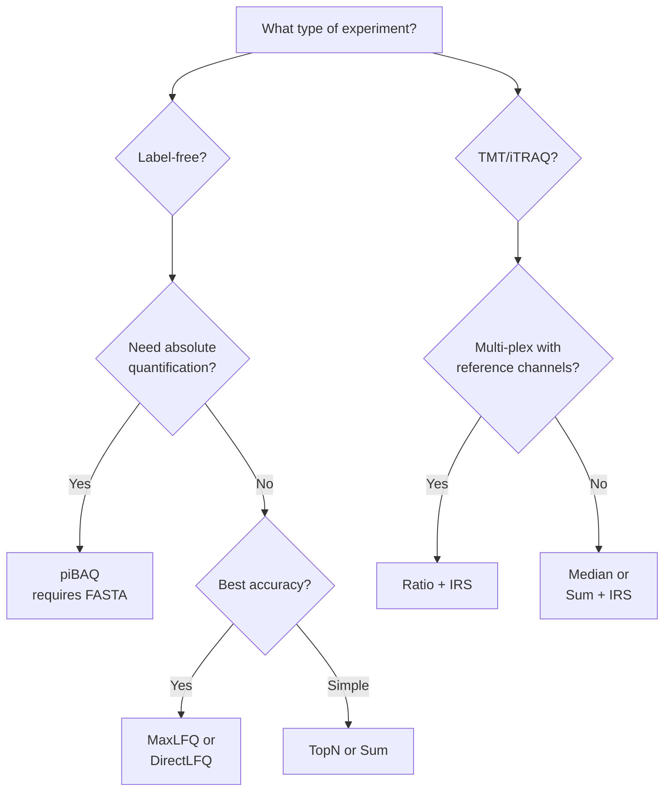

# Quantification Methods

mokume supports multiple protein quantification methods, each suited to different experimental designs and goals.

## Overview

| Method | Description | Requires FASTA | `--quant-method` |
|--------|-------------|:--------------:|------------------|
| **piBAQ** | Paralog-aware iBAQ with explicit shared-peptide allocation | Yes | `pibaq` |
| **TopN** | Average of N most intense peptides | No | `top<N>` (`top3`, `top5`, ...) |
| **MaxLFQ** | Delayed normalization with parallelization | No | `maxlfq` |
| **DirectLFQ** | Intensity traces with hierarchical alignment | No | `directlfq` |
| **Sum** | Sum of all peptide intensities | No | `sum` |
| **Ratio** | Log2 sample/reference per plex (PS protocol) | No | `ratio` |
| **TMT Abundance** | Median of log2 peptide intensities | No | `abd` |
| **TMT Reporter Intensity** | Sum of raw reporter intensities | No | `intensity` |
| **Median** | Median of peptide intensities | No | `median` |
| **Peptide Count** | Distinct canonical peptides per (protein, sample) from feature QPX | No | `peptide-count` |
| **Spectral Count** | Unique spectra per (protein group, sample) from paired PSM/feature QPX | No | `spectral-count` |

All aggregation methods run in the Rust kernel. piBAQ obtains its theoretical
peptide map from the base pyOpenMS dependency; the other methods need no Python
compute dependency. MaxLFQ and DirectLFQ are native Rust ports — DirectLFQ is no
longer a separate Python dependency.

## Choosing a Method



## piBAQ (Paralog-Aware iBAQ)

The original **iBAQ** definition divides summed peptide intensities by the
number of theoretically observable peptides per protein:

$$\text{iBAQ} = \frac{\sum \text{peptide intensities}}{\text{theoretical peptide count}}$$

The commonly cited observable window is stated in the Usage Notes of
[Krey et al. 2018 *Scientific Data*](https://www.nature.com/articles/sdata2018128):
the denominator counts theoretical tryptic peptides between 6 and 30 amino
acids. Mokume now uses 30 as the upper-bound default everywhere. Its shared
feature-filter default remains `--min-aa 7`, so the out-of-the-box Mokume
window is 7–30; pass `--min-aa 6` when reproducing the cited 6–30 definition.

Mokume calls its family-aware extension **piBAQ**. It retains that iBAQ
scaling while assigning shared peptides explicitly. Peptides are assigned to
canonical entries unless an alternative isoform has its own uniquely mappable
peptide. Shared-peptide allocation follows the gpGrouper area rule
([Saltzman et al. 2018 *MCP* 17:2270](https://www.mcponline.org/content/17/11/2270));
the foundational iBAQ definition comes from
[Schwanhäusser et al. 2011 *Nature* 473:337](https://doi.org/10.1038/nature10098).
For each sample independently:

- If at least one mapped member has positive proteotypic-peptide intensity, the shared peptide is allocated in proportion to those member intensities. A zero-signal member receives exactly zero.
- If every mapped member has zero proteotypic-peptide intensity, the shared peptide is split equally among them.

Each shared peptide is counted once, so its allocated intensities sum to the observed intensity. The resulting per-member numerator is divided by that member's owned theoretical-peptide count.

The default standalone option `--min-anchors 1` (or
`features2proteins --pibaq-min-anchors 1`) implements this rule directly. If
the threshold is raised and no family member reaches it, piBAQ marks the family
`family_only` and forces equal shared-peptide allocation rather than trusting
sub-threshold anchors.

### Shared peptides in `features2proteins` (`--pibaq-shared`)

The rule above is the legacy `proportional` mode. It has two side effects in
large multi-sample studies:

- when no member of a family has a unique peptide (`family_only`), every
  member receives the same equal split of the shared signal, so paralogs get
  identical profiles across samples (perfect artificial co-expression);
- when a member's unique peptides are missing in one sample, its siblings take
  the whole shared signal in that sample (or an equal split if all are
  missing), so values depend on detection rather than abundance.

`features2proteins` therefore defaults to `--pibaq-shared unique`:

- a member value is the sum of its family-unique peptides divided by its
  number of theoretical family-unique peptides; shared peptides never create a
  member value;
- a multi-member family with no unique-peptide evidence is reported as one
  family row, named by its members (`P1;P2;P3`), whose value is all owned
  peptide intensity divided by all owned theoretical peptides
  (`--pibaq-family-rows family-only`, the default; `all` adds a family row for
  every multi-member family, `none` disables them);
- single-member families are unchanged.

`--pibaq-shared stable-ratio` adds shared intensity to members that have unique
evidence in that sample, using one member ratio per shared-peptide member set
estimated across samples (median per-sample share over samples where every
member has unique peptides; otherwise each member's median unique level). A
member without unique evidence in a sample still gets no value, and its share
is not given to its siblings. The denominator is the member's owned
theoretical peptides (unique plus shared), as in legacy piBAQ.

`--pibaq-shared proportional` reproduces earlier releases exactly.
`peptides2protein` always uses the legacy rule.

`--pibaq-evidence FILE` writes one TSV row per member and family row:
`row_type` (`member`, `family`, `member_not_quantified`), `family_id`,
`family_members`, `evidence` (`family_only`, `medium`, `high`), the denominator
used (`theoretical_peptides`), theoretical and observed unique/shared peptide
counts, and the number of quantified samples. Rows describe the matrix before
IRS, coverage or correlation filters.

Family discovery proceeds in two layers:

1. **UniProt isoform collapse** — accessions of the form `P05067-2`, `P70255-3` are folded onto their canonical entry (`P05067`, `P70255`). This matches the UniProt convention and absorbs the bulk of "non-canonical isoform with no unique peptide" cases.
2. **Shared-peptide connected components** — proteins are grouped into a family when they share at least `min_shared` (default 2) digested peptides. Singleton families are equivalent to the per-protein baseline.

Power users can override either layer via standalone
`--families families.yaml` or `features2proteins --pibaq-families families.yaml`:

```yaml
families:
  - name: ACT
    members: [P60709, P63261, P68133]   # canonical accessions
  - name: HIST_H2A
    members: [P0C0S5, Q96QV6, P04908]
```

piBAQ requires a **FASTA file** to compute theoretical peptide counts via in-silico digestion.

=== "CLI"

    ```bash
    mokume quantify peptides2protein \
        --fasta proteome.fasta \
        --peptides peptides.csv \
        --enzyme Trypsin \
        --normalize \
        --quant-method pibaq \
        --output proteins-pibaq.tsv
    ```

=== "Python (wheel)"

    ```python
    import mokume

    mokume.peptides2protein(
        fasta="proteome.fasta",
        peptides="peptides.csv",
        enzyme="Trypsin",
        normalize=True,
        quant_method="pibaq",
        output="proteins-pibaq.tsv",
    )
    ```

!!! note
    piBAQ uses every protease registered by the installed pyOpenMS runtime,
    including `CNBr` and context-dependent rules such as
    `proline endopeptidase`. Python supplies the complete theoretical-peptide
    map and Rust performs the piBAQ aggregation.

The piBAQ output adds three metadata columns to the per-protein long-format table so users can audit protein-family support:

| Column | Type | Meaning |
|--------|------|---------|
| `FamilyId` | string | Canonical accession of the family representative (largest digested-peptide set) |
| `FamilySize` | int | Number of canonical members in the family (1 = singleton, isolated protein) |
| `EvidenceLevel` | enum | `high` (every member reaches the high-anchor threshold) / `medium` (at least one member reaches the minimum) / `family_only` (no member reaches the minimum) |

`family_only` means the data do not provide member-resolving anchor evidence. Shared signal is still conserved and allocated equally among the members it maps to; the final piBAQ values can differ because each member retains its own theoretical-peptide denominator.

Additional piBAQ-derived values:

| Value | Formula | Use Case |
|-------|---------|----------|
| PiBAQNorm | PiBAQ / sum(PiBAQ) per sample | Relative comparison |
| PiBAQLog | 10 + log10(PiBAQNorm) | Visualization |
| TPA | NormIntensity / MW | Total Protein Approach |
| CopyNumber | From ProteomicRuler | Absolute copy numbers |

TPA always uses each protein member's own molecular weight.

## TopN

Averages the **N most intense peptides** per protein per sample. The N is part
of the method name, so `--quant-method top3` averages the 3 most intense
peptides, `top5` the 5 most intense, and so on for any N ≥ 1.

Top3 is the classic choice — it is the named method from
[Silva et al. 2006 *MCP* 5:144](https://doi.org/10.1074/mcp.M500230-MCP200),
which showed that the mean intensity of a protein's three most intense
tryptic peptides scales with protein amount.

```bash
# Top3 (Silva et al. 2006)
mokume quantify features2proteins -p features.parquet -o proteins.csv \
    --quant-method top3

# Any other N — just write it in the method name
mokume quantify features2proteins -p features.parquet -o proteins.csv \
    --quant-method top5
```

!!! tip
    Top3 is a good default for label-free experiments when you don't need absolute quantification.

## MaxLFQ

The **MaxLFQ algorithm** (Cox et al., 2014) uses delayed normalization with pairwise peptide ratios to estimate protein intensities. It's particularly robust to missing values.

In the native Rust kernel, MaxLFQ rolls the peptide matrix up with the DirectLFQ estimator (delegating with `min_nonan = 2`). It is real-data compatibility-checked against frozen Python-generated output — cell-exact on PXD003539 within the f32 tolerance tier.

```bash
mokume quantify features2proteins -p features.parquet -o proteins.csv \
    --quant-method maxlfq
```

## DirectLFQ

**DirectLFQ** (Ammar et al., 2023) uses hierarchical normalization with variance-guided pairwise alignment. When used as the quantification method, it handles both normalization and quantification. It is a native Rust port of the DirectLFQ estimator — no separate Python dependency is needed.

!!! note
    When `--quant-method directlfq` is selected, the kernel handles normalization
    and quantification through the DirectLFQ estimator. External run/sample
    normalization defaults to `none`; non-`none` values are rejected.

```bash
mokume quantify features2proteins \
    -p features.parquet -o proteins.csv \
    --quant-method directlfq
```

## Sum (All Peptides)

Simply sums all peptide intensities per protein per sample. The simplest approach, useful as a baseline.

## Ratio (PS Protocol)

For **multi-plex TMT experiments with reference channels**, the ratio method computes log2(sample/reference) per PSM per plex, then aggregates to protein level via median.

```text
PSM intensities → average fractions → divide by reference → log2
→ median by peptide → median by protein → wide matrix
```

This method requires an SDRF file to detect reference samples and plexes.

For replicated conditions, `--min-sample-correlation <r>` can remove samples
whose normalized log2 protein profile has mean Pearson correlation below `r`
to its same-condition peers. The filter runs before protein coverage,
imputation, and batch correction, so neither imputed values nor batch-adjusted
values can inflate the QC score.

```bash
mokume quantify features2proteins \
    -p features.parquet -o proteins.csv -s experiment.sdrf.tsv \
    --quant-method ratio \
    --coverage-threshold 0.65
```

!!! info
    Ratio quantification handles cross-plex normalization inherently via
    per-plex reference division. Combining it with `--irs` is rejected.

## TMT Abundance

The `abd` method computes protein abundance as the **median of log2-transformed peptide intensities** per (protein, sample). Non-positive intensities are treated as missing.

```bash
mokume quantify features2proteins -p features.parquet -o proteins.csv \
    --quant-method abd
```

## TMT Reporter Intensity

The `intensity` method computes protein abundance as the **sum of raw reporter intensities** per (protein, sample) in linear space — no log transform, no aggregation choice.

```bash
mokume quantify features2proteins -p features.parquet -o proteins.csv \
    --quant-method intensity
```

## Peptide and Spectral Counts

`peptide-count` is the feature-level identification-depth metric: it counts
distinct modification-stripped sequences per protein/sample. It requires
run/sample normalization `none` and does not accept IRS because intensity
scaling cannot change peptide membership.

```bash
mokume quantify features2proteins -p features.parquet -o proteins.csv \
    --quant-method peptide-count
```

`spectral-count` instead requires matching PSM-level and feature-level QPX
parquets plus SDRF. A PSM's `feature_id` resolves its protein group from the
feature table's `pg_accessions` (falling back to `anchor_protein`). Mokume
removes decoys, maps runs to samples through the SDRF, and counts each unique
QPX `psm_id` once. Protein ambiguity within one linked feature remains one
sorted protein-group key, while distinct PSMs sharing a scan remain separate.
Duplicate `psm_id` values are rejected. PSM rows without a matching feature
link are not counted. As with `peptide-count`, intensity normalization and IRS
are rejected.

```bash
mokume quantify features2proteins --psm identifications.psm.parquet \
    --parquet quantified.feature.parquet \
    --sdrf experiment.sdrf.tsv -o spectral_counts.csv \
    --quant-method spectral-count
```

## Standard Output Format

All quantification methods produce a standard `Intensity` column in long format, which the pipeline converts to wide format (proteins x samples) for the final output.
